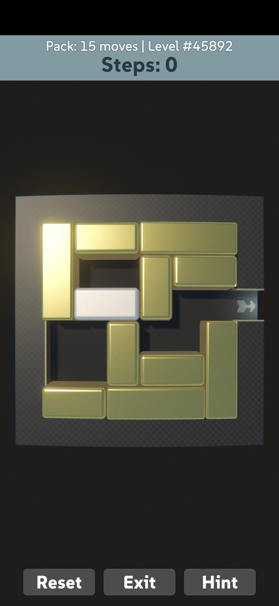
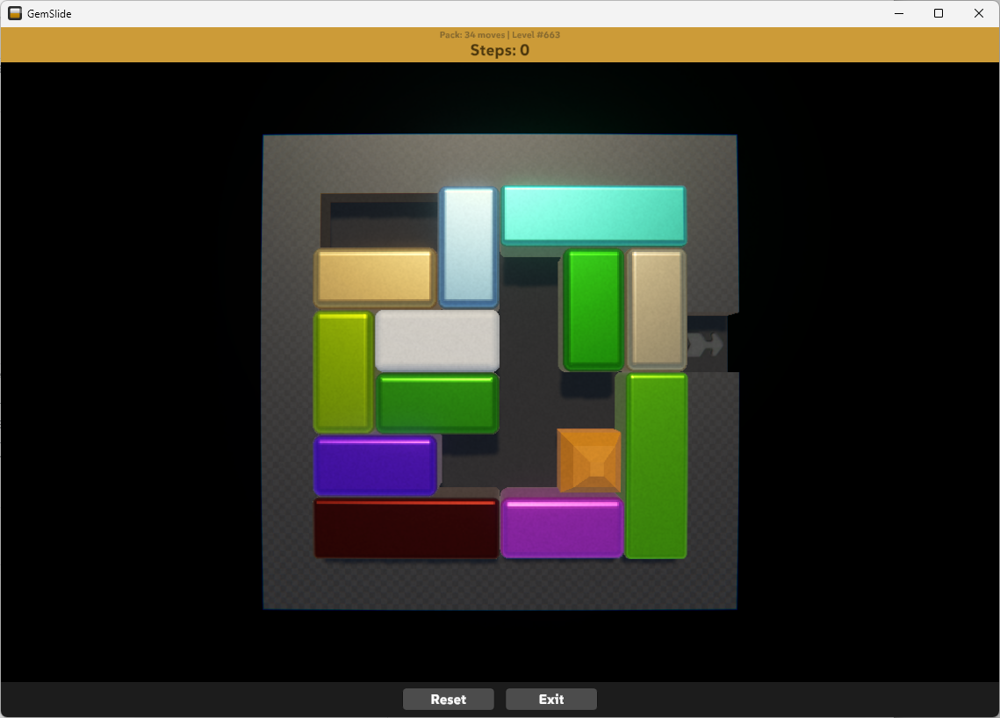
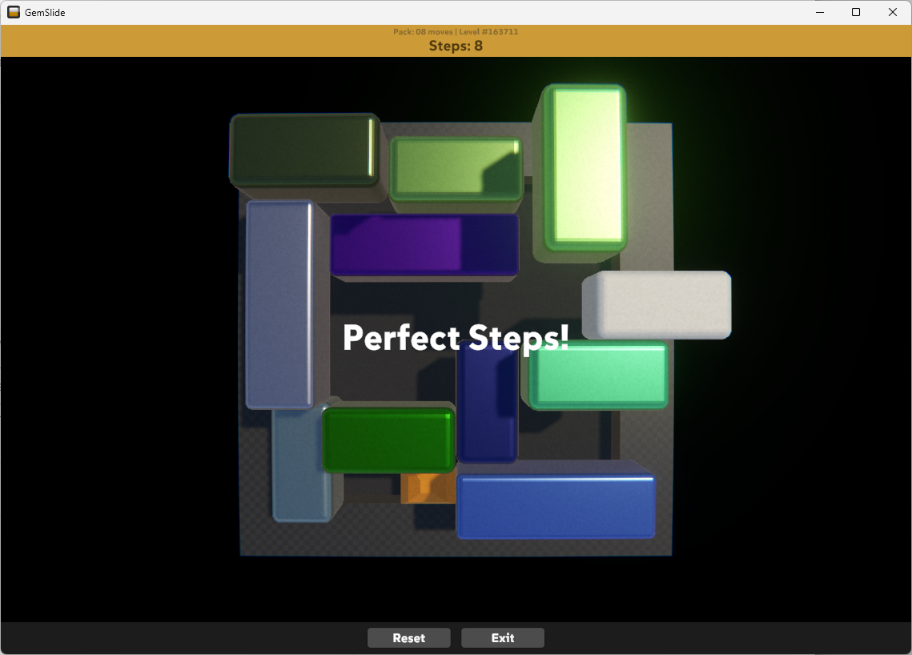
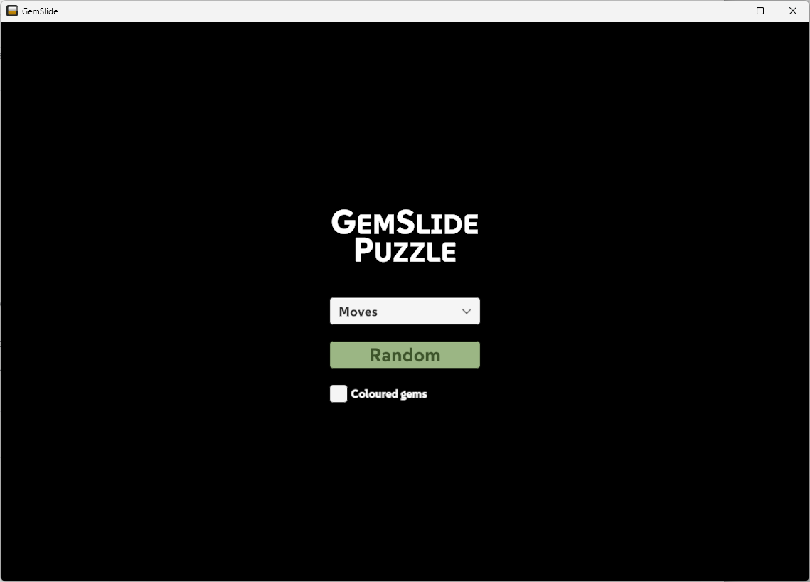
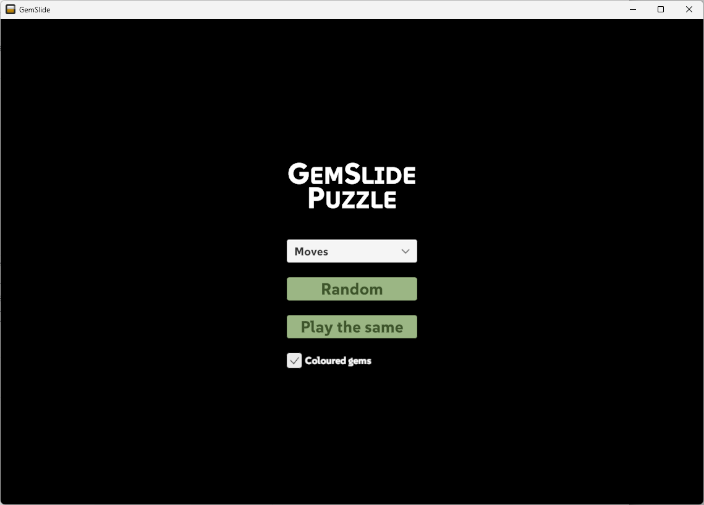

# Gem Slide

Sliding boxes puzzle. This is a learning project to get into Unity.

### Todo

- Bug: no clink on fast swipe
- Bug: 35/412 - solution get stuck
- Volume to clink sound
- Download levels
- Config
  - music

### Credit

It's using the amazing puzzle map database from Michael Fogleman: https://www.michaelfogleman.com/rush/#DatabaseDownload