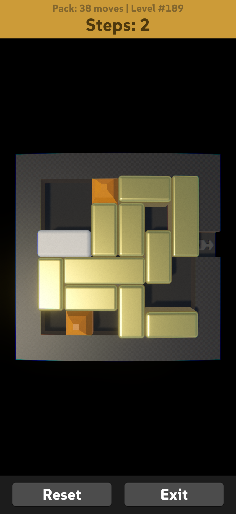
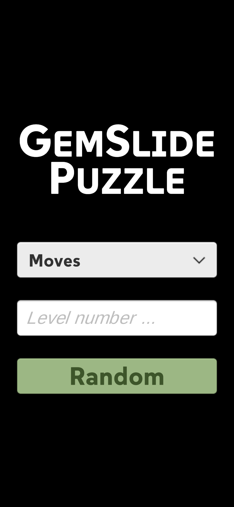

# Gem Slide

Sliding boxes puzzle. This is a learning project to get into Unity.

### Todo

- Perfect game indicator (if done in same steps)
- Icon
- Level start animation (falling in)
- Volume to clunk sound
- Download levels
- Config
  - music
  - gem colors

### Credit

It's using the amazing puzzle map database from Michael Fogleman: https://www.michaelfogleman.com/rush/#DatabaseDownload