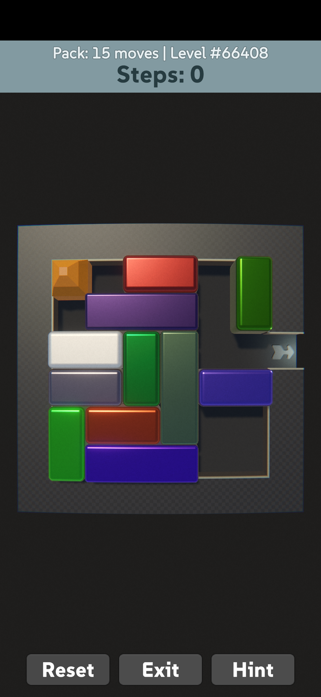

# Gem Slide

Sliding boxes puzzle. This is a learning project to get into Unity.

### Todo

- Volume to clink sound
- Clunk sound during hint
- Hint speed in game mode is slow (180ms vs 20ms)

Low priority:

- Bug: no clink on fast swipe
- Hint to bg thread
- Download levels
- Config: music/sound

### Credit

It's using the amazing puzzle map database from Michael Fogleman: https://www.michaelfogleman.com/rush/#DatabaseDownload
